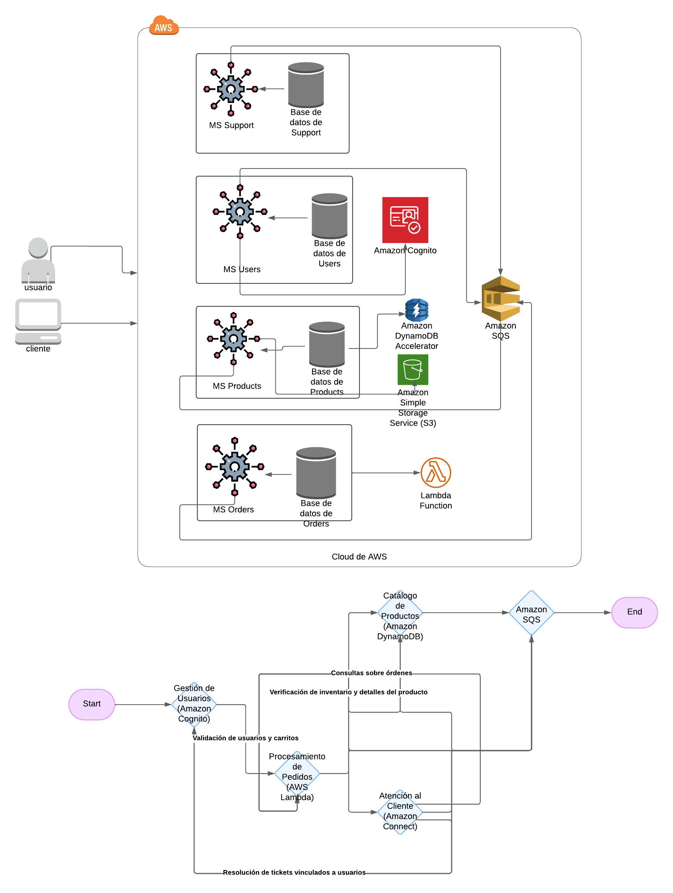

## Descripción de la Aplicación Monolítica
La aplicación monolítica actual:
--
- **Gestión de usuarios:** Perfiles, autenticación, autorización, preferencias de usuarios.

- **Catálogo de productos:** Descripciones, precios, inventario, búsqueda y categorización.
- **Procesamiento de pedidos:** Carritos, pagos, historial y seguimiento de pedidos.
- **Atención al cliente:** Tickets, consultas, devoluciones, quejas y comentarios.

## Problemas:
- Escalabilidad limitada.
- Tiempos de inactividad frecuentes durante actualizaciones.
- Implementación compleja de nuevas funcionalidades.
---
## Diseño Propuesto de Arquitectura de Microservicios
Identificación de Microservicios
Basándonos en principios de diseño orientados al dominio, los microservicios serán:
1. Servicio de Gestión de Usuarios:
   Funciones: Autenticación, autorización, gestión de perfiles.
   Base de datos propia para almacenar información personal y preferencias.
2. Servicio de Catálogo de Productos:
   Funciones: Gestión del inventario, búsqueda y categorización de productos.
   Base de datos optimizada para consultas rápidas de productos.
3. Servicio de Procesamiento de Pedidos:
   Funciones: Carritos, pagos, historial de pedidos.
   Comunicación directa con el servicio de usuarios (para autenticación) y el servicio de catálogo (para inventarios).
4. Servicio de Atención al Cliente:
   Funciones: Gestión de tickets, devoluciones, comentarios.
   Dependencias: Acceso a datos de usuarios y pedidos para resolución de tickets.
---
Comunicación entre Microservicios
Se propone usar API RESTful para la comunicación entre microservicios, con un Message Broker (como RabbitMQ o Kafka) para eventos críticos, como:
Notificaciones de actualización de inventario.
Confirmaciones de pago.
Alertas de atención al cliente.
Gestión de Datos Compartidos
1. Cada microservicio tendrá su propia base de datos para evitar dependencias directas.
2. La consistencia eventual se manejará mediante eventos asincrónicos.
3. Se implementará un sistema de CQRS para consultas interservicio, si es necesario.
---
Simulación de Implementación
Hoja de Ruta de Migración
1. Análisis de Dependencias:
   Identificar los módulos del monolito y sus relaciones actuales.
   Documentar las tablas afectadas y las dependencias cruzadas.
2. Priorización de Migración:
  - Paso 1: Migrar el Servicio de Gestión de Usuarios como base de autenticación.
  - Paso 2: Migrar el Servicio de Catálogo de Productos para manejar la lógica independiente de usuarios y pedidos.
  - Paso 3: Migrar el Servicio de Procesamiento de Pedidos, incluyendo carritos y pagos.
  - Paso 4: Migrar el Servicio de Atención al Cliente como última fase.
3. Estrategia de Migración de Datos:
   Migrar datos existentes en paralelo al desarrollo de cada microservicio.
   Diseñar una capa de compatibilidad para evitar interrupciones durante la migración.
4. Estrategia de Pruebas:
   Implementar pruebas integrales para asegurar que los nuevos servicios funcionen antes de desactivar el monolito.
---
Documentación de la Arquitectura
--
Diagrama de Microservicios Propuesto

Decisiones Clave
1. Bases de Datos Separadas: Mejora la escalabilidad y permite el despliegue independiente.
2. Mensajería Asincrónica: Reduce la latencia y desacopla los servicios.
3. Diseño API RESTful: Simplifica la comunicación y facilita la integración futura.
---
Reflexión y Alternativas
- Utilizar GraphQL para centralizar las consultas.
- Adoptar una arquitectura basada en eventos para una integración más fluida.
- Implementar funciones serverless para tareas como notificaciones de inventario.
